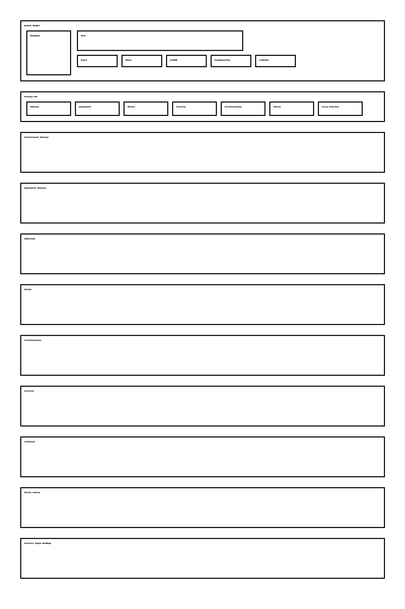

# Personal Resume & HTML Practice

This repo tracks my front-end practice. Everything lives in a few simple files so I can focus on fundamentals and grab some quick CSS notes while I go.

- `html/index.html` – my DevOps resume as a single-page site styled by `css/styles.css`. `js/scripts.js` is wired up but currently commented out.
- `html/table_styling.html` – a tiny table sandbox using semantic tags (`caption`, `thead`, `tbody`, `tfoot`).
- `html/practice-forms.html` – the Login/Register exercise built with two `<fieldset>` blocks.
- `html/get-in-touch.html` –  (challenge).
- `html/login-card.html` 
- `assets/images/resume_wireframe.png` – the wireframe I drew before coding.

## Practice Log

- Added a horizontal navigation bar to `index.html` with a styled `<ul>`.
- Turned the practice table into a “Skills Matrix” section.
- Built `practice-forms.html` to mirror the form exercise from class.
- Matched the “Get in touch” page with `get-in-touch.html`.
- Matched the “User Login” page with `login-card.html`.
- Captured the resume wireframe for homework.

## Wireframe

## How to Run

1. Open any HTML file with Live Server .
2. Update `css/styles.css` to try different spacing, fonts, or layouts.
3. Preview `html/get-in-touch.html` and `html/login-card.html`
<!-- 3. Use `js/scripts.js` to prototype JavaScript behavior (expand/collapse, highlights, etc.). -->

## CSS Notes

- **Outer display** — controls how an element itself participates in layout (`block`, `inline`, `inline-block`, `list-item`).
- **Inner display** — controls how that element arranges its children (`flex`, `grid`, `flow`, `ruby`).

`.top-section` in `html/index.html` already works this way: the section itself behaves like a block, and the inner flex layout positions the headshot beside the contact info. A commented mini-example lives near the top of `html/index.html` (with matching notes in `css/styles.css`) when I need a quick refresher.
